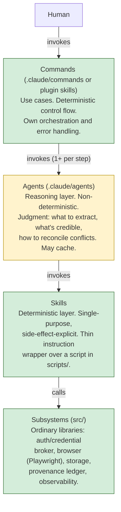
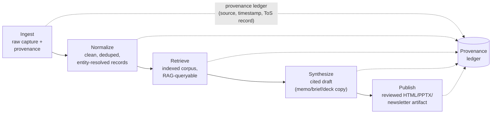

# Deebot — an agentic research operating system for institutional investment work

> **Contract status:** Draft v0.2. Scope was deliberately narrowed on 2026-09-06:
> **the only committed scope in this document is §6 — Module 0, the three
> builders.** Everything from §7 onward (the five pillars, the design system,
> the later milestones) is a design sketch carried forward from v0.1, not
> agreed scope, and is re-opened for revision once Module 0 lands (§10,
> Phase 2). Inputs the source process asks for but that were not supplied
> (named source list, corpus size, licensed-vendor access, entity taxonomy,
> voice exemplars, brand assets, hard compliance constraints, the specific
> first deliverable) remain marked inline as `[ASSUMPTION: …]` and rolled up
> in §12 — **none of them block Module 0**, which is why Module 0 is what gets
> built first.

## 1. Problem statement

The user is Head of Multi-Asset Solutions at Northern Trust Asset Management —
a CFA charterholder and FINRA-licensed investment professional whose work spans
client-facing investment leadership, product development, competitive
intelligence, and business development across institutional and intermediary
channels, concentrated in private markets, OCIO, and model portfolios. She is
technically fluent — she builds her own Python optimizers and large HTML/
Chart.js decks — so the constraint on her output is not capability, it is time.

Her research-to-publication workflow today is almost entirely manual. Source
material arrives from dozens of blogs, asset-manager and consultant websites,
regulatory filings, fund documents, and PDFs. She reads each one, extracts the
figures and claims that matter, reconciles them against what she already knows,
and then rebuilds essentially the same analysis three times over: once as a
memo, once as a deck, once as a newsletter or LinkedIn post. Nothing produced
in step one is reused in step two. Nothing is indexed, so nothing from three
months ago is retrievable except by memory or by re-reading the original
source. Every deliverable starts from a blank page, even when 80% of its
content — the underlying facts, figures, and citations — was already
assembled for a previous one.

`[ASSUMPTION: no per-deliverable time figures were supplied — the process this
PRD follows asks for hours-per-deliverable quantification, and none should be
invented. Directionally: a research memo or competitive-intel brief that draws
on 5–15 sources plausibly costs multiple hours of reading and reconciliation
before any writing starts, and that cost is paid again, from scratch, for each
of the three output surfaces. Replace this paragraph with real numbers once
she provides them — they matter for §11's success metrics.]`

The cost of the status quo is threefold: (a) research time is spent re-doing
extraction and reconciliation that a system could do once and reuse, (b) work
product has no institutional memory — a figure verified in March has to be
re-verified in June because it isn't indexed anywhere queryable, and (c) the
three output surfaces (memo, deck, newsletter/LinkedIn) are maintained as
independent artifacts with no shared source of truth, so a correction made in
one doesn't propagate to the others.

## 2. Users and usage contexts

**Primary user.** The user herself, working solo from a local Mac. She
initiates ingestion (scheduled and on-demand), reviews and corrects what the
system extracts, drives synthesis of memos and briefs, and is the sole
approver before anything publishes. Every design decision in this document
optimizes for her as a single expert operator, not for a multi-seat product.

**Secondary users.** `[ASSUMPTION: not confirmed — plausible secondary
consumers are colleagues on the Multi-Asset Solutions team who might receive
finished decks/memos, or a research associate who could eventually help
triage ingestion. The system should not architecturally foreclose this (see
§9's access-control note), but nothing in Phase 1–3 should be built
specifically for a second seat until she asks for one.]`

**Tertiary / gating role.** Whoever performs compliance or reviewer sign-off
before a deliverable reaches a client or the public — today, most likely the
user herself acting as her own reviewer, with the review-gate mechanism (§9)
designed so a formal compliance reviewer could be inserted later without
rearchitecting the publish pipeline.

## 3. Goals and non-goals

**Goals**

- Collapse ingest → normalize → retrieve → synthesize → publish into a
  pipeline where each stage's output is a durable, inspectable file — not a
  chat transcript — that the next stage and any future stage can consume.
- Make every fact that reaches a published deliverable traceable to a specific
  source document, capture timestamp, and location within it (page or
  paragraph anchor), so "where did this number come from" is always
  answerable in one lookup, not a re-read.
- Let a memo, a deck, and a newsletter about the same underlying research draw
  from the same normalized corpus and the same verified figures, so a
  correction made once is available to all three surfaces.
- Produce output in the user's own analytical voice — prose-forward,
  argumentative, institutional-finance register — not generic AI house style.
- Build the component builders (§6) once, first, so every command, agent
  and skill written afterward is born conforming to one set of conventions
  instead of each pillar inventing its own. The rest of the meta-layer —
  schema registry, output validation, run traces, error taxonomy — is
  deliberately deferred until there are real components to design it
  against (§6.5).

**Non-goals**

- **Not a multi-tenant product.** This is a single-operator system for one
  named user on her own machine. It is not being built to onboard other users,
  support role-based access control across a team, or serve as a SaaS
  offering. If that changes, it is a new set of requirements, not an
  extension of this one.
- **Not a general-purpose web scraper or crawler.** Ingest targets a
  deliberately bounded, named set of sources she actually reads (§7.1) — it is
  not a discovery engine that finds new sources on its own, and it does not
  attempt to be comprehensive over the open web.
- **Not a replacement for her judgment on credibility, framing, or house
  view.** Retrieval surfaces sources with metadata and confidence signals;
  synthesis drafts arguments; neither is authorized to publish a final
  editorial position without her review (§9's review gate is non-negotiable,
  not a v2 nicety).
- **Not a trading, portfolio-construction, or order-routing system.** Nothing
  here reads or writes live positions, executes trades, or touches any system
  of record for client assets. It only reads public/licensed research
  content and produces documents.
- **Not a compliance-approval system.** It can enforce that a review gate
  exists and that citations are present; it cannot and does not substitute
  for the firm's actual compliance review process, and it must not be
  described to anyone as having done so.
- **Not attempting real-time or streaming ingestion.** Sources are polled on
  a schedule or pulled on demand; there is no requirement for sub-minute
  freshness anywhere in this system.
- **Not building bespoke connectors for licensed data vendors ahead of
  confirming ToS.** PitchBook, Bloomberg, Morningstar-class integrations are
  explicitly out of scope for automated ingestion until their terms are
  reviewed (§9) — this project will not quietly build a scraper against a
  vendor whose ToS forbids it.

## 4. Architecture overview

The system is organized as four layers, ordered by determinism and by who is
allowed to call whom. Calls point downward only; dependencies point inward
only. A skill never invokes an agent. An agent never invokes a command.

The inversion worth stating explicitly: the middle layer (agents) is the
non-deterministic one, sandwiched between a deterministic caller (commands)
and a deterministic callee (skills). Both boundaries need enforced contracts
as a result — a command cannot assume an agent's output is well-formed just
because the prompt asked for it, and a skill's CLI contract is the only thing
standing between "the agent decided to call this" and "the side effect that
actually happened." §6 specifies enforcement for both boundaries separately.
Any cache at the agent layer must key on **input + prompt version + model
identifier** — caching on input alone will silently serve reasoning from a
stale prompt or a retired model indefinitely.

The five-stage pipeline is orthogonal to this layering — each stage is
implemented using command → agent → skill → subsystem calls, and each stage's
output is a durable artifact the next stage reads from disk (or from the
corpus store), never from the prior stage's live context:

Each arrow in the pipeline diagram is a durable-artifact handoff, not a
function call — normalize does not run inside ingest's process, it reads
ingest's output. This is what makes each stage independently inspectable,
re-runnable, and debuggable in isolation, and it's why the observability
requirement in §6 records a step trace per stage rather than one opaque trace
for the whole run.

## 5. Packaging and namespacing

`[ASSUMPTION: the source process for this PRD asks that plugin-vs-command
behavior be verified against current Claude Code docs and empirically
confirmed before scaling, because the artifact model has moved recently and
documented nesting behavior has not always matched reported behavior. That
verification has not been run yet — it is Phase 1's first task (§10), not a
settled fact. Everything in this section is the target design, contingent on
that spike confirming `<plugin>:<skill>` resolution actually works on the
installed Claude Code version.]`

The namespacing unit is the plugin: a directory with a
`.claude-plugin/plugin.json` manifest holding `skills/`, `agents/`, and hooks,
whose skills are invoked as `<plugin>:<skill>`. This namespace can't collide
with skills defined at other levels, which is the property flat
`.claude/commands/` files don't reliably give once nesting is involved.

**One subsystem, one plugin.** Ingest, normalize, retrieve, synthesize,
publish, and meta each become their own plugin in a local marketplace repo,
versioned and installed independently. Adding a sixth pillar later means
adding a seventh plugin, not deepening a directory tree — that's the scaling
property this model is chosen for.

**Naming convention.** `<subsystem>:<object>-<verb>` — object before verb,
enforced consistently so the catalog stays guessable: `/ingest:source-scrape`,
`/normalize:table-extract`, `/retrieve:corpus-query`, `/publish:deck-render`,
`/meta:skill-build`. The three builders in Module 0 (§6) are the enforcement
point — they should refuse to scaffold a name that doesn't fit the pattern
rather than relying on convention alone.

**User-facing vs. internal is a frontmatter property, not a location.**
Orchestration entry points are marked user-invocable; internal machinery
(a normalize sub-step, a validator an agent calls) is marked not
user-invocable. This keeps the `/`-command surface small and legible as the
component count grows, independent of how many files live under the hood.

**The skill-vs-script registration threshold.** Every registered skill's
description occupies context on every request — a growing catalog is a
standing token cost paid whether or not that skill is used this turn. Skills
are the *interface*; scripts in `scripts/` are the *implementation*. An agent
invoking a Python CLI through Bash costs nothing at rest; the same logic
registered as a skill costs tokens forever. The threshold: **register a skill
only when an agent needs to discover it without being told which one to use**
— i.e., when the choice of tool is itself part of the judgment being
delegated to the agent. If a command step already knows exactly which script
to run and just needs an agent to supply arguments or interpret output,
that's a direct script call, not a skill registration. Concretely: something
like `pdf-table-extract` (one clear job, always the right tool when a PDF has
a table) is a script an agent shells out to; something like
`source-credibility-assess` (the agent must decide *whether* and *how* to
invoke judgment-bearing logic, and other agents may need to discover it too)
is a registered skill.

**Verification step (Phase 1, first task).** Build one throwaway plugin with
one skill, confirm it resolves as `<plugin>:<skill>` on the installed Claude
Code version, and record the result in `PROGRESS.md` before generating any
other component against this assumption.

## 6. Module 0 — the three builders

**Scope.** Module 0 is three commands and nothing else:
`/meta:command-build`, `/meta:agent-build`, `/meta:skill-build`. Each
scaffolds a new component of its kind that already conforms to every
convention in §4 and §5. This is the whole of Module 0's committed scope.

Everything else the meta-layer will eventually need — the versioned schema
registry, generated runtime types, the post-agent output validator, run
traces, the error taxonomy — was specified in v0.1 of this document and is
now **deferred** (§6.5). The reason is ordering, not doubt: those pieces are
contracts *between pipeline stages*, and no pipeline stage exists yet, so
building them now means designing against imagined consumers and guessing at
payload shapes. The builders are the opposite case — they are needed the
moment any component is written at all, and building them first means every
component that follows is born conforming rather than retrofitted.

### 6.1 Prerequisite — the namespace spike

The builders scaffold *into* a plugin layout, so the layout has to be known
good before they encode it. Before any builder is written: one throwaway
plugin, one skill, confirm it resolves as `<plugin>:<skill>` on the installed
Claude Code version, and record the result in `PROGRESS.md` (§5).

`[ASSUMPTION: the spike confirms plugin resolution works, and the builders
therefore target the plugin layout in §5. If it does not, the builders target
flat `.claude/commands/` and `.claude/agents/` files instead, and the
`<subsystem>:<object>-<verb>` naming becomes a filename convention
(`meta.command-build.md`) rather than a namespace. That fallback changes what
the builders emit, not what they are for — it is a one-day change of
templates, which is precisely why the spike runs first and cheaply.]`

### 6.2 What each builder produces

Each builder takes a component name and a one-line statement of purpose, and
writes a complete, runnable skeleton — not a blank file with a heading.

**`/meta:command-build`** — the orchestration layer (§4: deterministic,
human-invoked, may call agents).

- Markdown file at the correct path for its subsystem plugin.
- Frontmatter: name, one-line description, user-invocable flag (§5 — this is
  a property, not a location).
- Body skeleton matching the house structure already used by this repo's
  `/dev:*` commands: a **Rules** section (what this command must not do), a
  numbered **Process** section, and an **Output** section stating what the
  human reads at the end.
- An explicit declaration of which agents and skills the command may invoke,
  so the §4 downward-only rule is stated in the artifact rather than assumed.

**`/meta:agent-build`** — the reasoning layer (§4: non-deterministic,
invoked by commands, may call skills).

- Markdown file under the plugin's `agents/`.
- Frontmatter: name, description, and the explicit tool allowlist — an agent
  gets the narrowest tool set that does its job, never `*` by default.
- An **input contract** block and an **output contract** block written into
  the prompt body as literal shapes the agent must honor. In Module 0 these
  are hand-written inline, not generated from a registry (§6.5).
- A stated judgment boundary: the one decision this agent is being trusted to
  make, and what it must escalate rather than decide.

**`/meta:skill-build`** — the deterministic layer (§4: single-purpose,
side-effect-explicit, a thin wrapper over a real script).

- The thin instruction wrapper (`SKILL.md`) — interface only.
- A **real executable stub** in `scripts/`: an argparse CLI with a `--json`
  flag, a documented exit-code contract, and non-zero exit plus a structured
  error on stderr when its own output doesn't match the shape it promises.
  A skill that scaffolds without a runnable script is a lie about the layer
  it belongs to.
- A test fixture that invokes the stub and asserts the `--json` output shape,
  so the component ships with one check that actually runs.

### 6.3 What all three enforce

These are the reason the builders exist at all — conventions that survive
because a tool applies them, not because someone remembered.

- **Naming.** `<subsystem>:<object>-<verb>`, object before verb (§5). A name
  that doesn't fit is **refused**, with the conforming suggestion offered.
  The builders are the enforcement point for this convention; if they merely
  warn, the catalog degrades within a month.
- **Layer discipline.** A command may call agents and skills; an agent may
  call skills; a skill calls only `src/` subsystems. The builders will not
  scaffold an upward call (§4).
- **The registration threshold.** `/meta:skill-build` asks whether an agent
  must *discover* this capability without being told to use it (§5). If not,
  it scaffolds a plain script in `scripts/` and declines to register a skill —
  because every registered skill's description is a token cost paid on every
  request forever.
- **No silent overwrite.** A builder never overwrites an existing component;
  it stops and reports the collision.
- **Catalog entry.** Every generated component is added to a single catalog
  file, so "what exists" is answerable by reading one file rather than
  walking directories.

### 6.4 Acceptance test — self-hosting

Module 0 is done when **`/meta:command-build` generates a working replacement
for itself**, and the same holds for the other two within their own kind. Not
inspection, not a review of the templates: the generated artifact runs and
does the job the original did.

This is the acceptance test rather than a nice-to-have because it is the only
test that can fail for the right reason. If a builder cannot regenerate
itself, the convention it encodes is underspecified — there is some rule its
own author knew and did not write down — and that is exactly the defect
Module 0 exists to prevent.

### 6.5 Deferred out of Module 0

Specified in v0.1, deliberately not built now. Each is revisited in the
Phase 2 PRD review (§10), by which point there will be real components to
design them against.

| Deferred | Why it waits | What re-opens it |
|---|---|---|
| Versioned JSON Schema registry | Schemas describe inter-stage payloads; no stage exists to have a payload | The first two pipeline stages that must hand data to each other |
| Generated runtime types (Pydantic) and schema-block injection | Generation targets need a registry to generate from | The registry landing |
| Post-agent output validator and re-prompt loop | Needs a schema to validate against, and a real agent whose output goes wrong in a real way | The first agent in production use |
| Retry budget (the 2-retries/3-tries placeholder, §12 #12) | A number invented before observing a single failure is a guess | The validator landing |
| Run IDs and structured step traces | Traces make chains of agent calls debuggable; there are no chains yet | The first multi-step command run |
| Error taxonomy (five classes, v0.1 §6) | Its classes are pipeline failures — source unreachable, empty retrieval, partial extraction — that only the pillars can produce | Ingest work starting |
| CI schema-compatibility check | Nothing to check for compatibility | The registry landing |

The builders should be written so these are additive later — a generated
component's contract blocks are hand-written now and registry-generated
later, in the same slots. They should not be pre-wired to a registry that
doesn't exist.

### 6.6 What Module 0 does not depend on

None of the twelve open questions in §12 block it. Module 0 touches no
source, no corpus, no client content, no vendor data, and no brand asset —
so the MNPI/data-residency question (§12 #1), the source list (#3), the first
deliverable target (#4), and the voice exemplars (#7) can all stay open while
it is built. This is the reason it is first.

## 7. The five pillars

> **Status: design sketch, not committed scope.** Carried forward from
> v0.1 and revised in the Phase 2 PRD review (§10), after Module 0 lands.
> Nothing here is built against until then.

### 7.1 Ingest

**Requirements.** Scheduled and on-demand acquisition from three source
types: web sources (blogs, research pages, press releases), document drops
(fund PDFs, PPMs, LP reports, consultant papers, 10-Ks), and manual
paste-ins. Must handle JavaScript-rendered pages, paywalls she legitimately
subscribes to, and PDFs that are scanned images rather than text. Must be
polite: robots.txt compliance, rate limiting, an identifiable user agent, and
a per-source ToS record kept in the provenance ledger.

**Chosen approach.** Sources are config-driven, not hardcoded per connector —
a source registry entry (URL pattern, fetch strategy, auth requirement,
schedule, robots.txt/ToS status) is what ingest reads, so adding a source is
a config change, not new code, until a source needs genuinely bespoke
handling. `[ASSUMPTION: the concrete initial source list was not supplied —
the process this PRD follows explicitly forbids inventing one. The registry
design above is chosen specifically so that filling it in later is additive,
not a redesign.]`

The local-Mac-plus-GitHub-Actions deployment split (confirmed) creates a real
architectural boundary, not just a scheduling choice: **GitHub Actions runs
ephemeral containers with no access to her authenticated browser session.**
Sources reachable without login (public blog HTML/RSS, press releases,
public regulatory filings) are scheduled as cron-triggered GitHub Actions
workflows that run the ingest skill's CLI directly and push captured raw
files + provenance records to the corpus store. Sources behind a login or
paywall she subscribes to require a real Playwright session with
`storageState` persisted from an authenticated local session — those run
on-demand, locally, initiated from a Claude Code session on her Mac, never
from Actions. `[ASSUMPTION: no source has been classified yet as
authenticated vs. public — the registry entry's auth field is where that
classification lives once the source list exists.]` Licensed vendors
(PitchBook, Bloomberg, Morningstar-class) are excluded from both paths by
default pending §9's ToS review — see that section before building any
connector against one.

Scanned-image PDFs get OCR at ingest time (raw capture) with the OCR
confidence score carried forward as a field on the record, so normalize and
retrieve can treat low-confidence OCR text differently from clean extracted
text rather than trusting both equally.

**Alternatives considered.** A single always-on ingest daemon (local or
cloud) was rejected: it doesn't fit "local Mac, not always running," and it
collapses the authenticated/unauthenticated boundary that GitHub Actions'
ephemeral, session-less environment forces to be explicit — a boundary that's
useful to keep explicit anyway, since it's exactly the line licensed-vendor
ToS review needs to sit on.

### 7.2 Normalize

**Requirements.** Boilerplate/nav-chrome stripping, deduplication across
near-identical syndicated copies, table extraction from PDFs into structured
form, entity resolution (the same manager, fund, or index under six
spellings), unit/currency normalization, and as-of-date stamping. Every
record keeps a pointer to its source and capture timestamp — non-optional.

**Chosen approach.** Normalize is where the schema registry (§6) starts
mattering operationally: a normalized record is the first artifact with a
locked shape that retrieve, synthesize, and publish all depend on, so its
schema is versioned from day one even though the pillar itself starts thin.
Entity resolution begins from `[ASSUMPTION: no seed taxonomy of managers/
funds/indices was supplied — normalize starts with an empty alias table and
grows it as records are processed, using fuzzy match plus an agent judgment
call for ambiguous cases, with her confirming merges above a low-confidence
threshold rather than the system silently merging two entities that happen
to look similar.]` Deduplication runs on normalized text (post
boilerplate-strip), not raw HTML, since two syndicated copies of the same
release rarely match byte-for-byte but do match after chrome removal.

**Alternatives considered.** Running entity resolution as a fully automated,
no-human-in-the-loop process was rejected — a wrong auto-merge (two distinct
funds treated as one) corrupts every downstream retrieval and citation
silently, which is a worse failure mode than asking her to confirm an
ambiguous merge occasionally.

### 7.3 Retrieve

**Requirements.** RAG over the normalized corpus, with metadata filters that
make retrieval usable in this domain: asset class, manager, geography,
document type, as-of date, and source confidence. Answers must cite source
documents with page or paragraph anchors.

**Chosen approach.** Hybrid retrieval (dense + BM25) with reranking is
adopted as the default, per the source process's stated hypothesis — this
domain has both semantic queries ("funds with a similar strategy to X") and
exact-term queries ("show me every mention of a specific fund's Q2 NAV"),
and BM25 covers the latter far better than dense retrieval alone, which tends
to blur exact figures and proper nouns. `[ASSUMPTION: embedding model and
vector store are unresolved — Anthropic does not ship a first-party
embeddings API, so this needs either a partner embedding model (e.g. Voyage
AI, Anthropic's recommended partner) or a local embedding model, and the
choice depends directly on the data-residency answer that's still open in
§9. Not decided here.]` Given the confirmed local-Mac deployment and
`[ASSUMPTION: 6–24 month corpus size of low-hundreds to low-thousands of
documents — not confirmed]`, a single-node local vector store (e.g. a
file-backed store rather than a hosted cluster) is the working assumption
until real corpus-size numbers say otherwise.

Every retrieval result carries its confidence/source-quality metadata through
to synthesis — a hybrid-retrieval hit from a licensed, dated primary document
should be weighted differently by synthesis than one from an unattributed
blog aggregator, and that distinction has to survive the retrieval → synthesis
handoff as data, not be re-derived by synthesis from scratch.

**Alternatives considered.** Dense-only retrieval was considered and rejected
per the reasoning above. A managed/hosted vector database was considered and
deferred rather than rejected outright — it's the right call if corpus size
or query volume outgrows a local store, but adopting one now would mean
sending fund and LP document content to a third-party host before the
data-residency question in §9 is resolved.

### 7.4 Synthesize

**Requirements.** Research memos, IC memos, competitive-intelligence briefs,
and benchmarking analyses, written in the user's voice — prose-forward,
argumentative, institutional-finance register, structurally disciplined
without being bullet-slop. Numeric claims must be traceable and verified;
a claim without a source must be blocked from reaching a draft.

**Chosen approach.** Voice is captured as a combination of a written style
guide (register, sentence structure, banned generic phrasings) plus few-shot
exemplars drawn from her own prior work, with a critic pass that specifically
checks a draft against the style guide and rejects generic-AI phrasing before
a draft is considered ready for her review. `[ASSUMPTION: no exemplar
documents were supplied yet — synthesize ships Phase 1 with a generic
institutional-finance style guide only, and the few-shot layer activates once
she points to a folder of prior memos/posts. This is one of the highest-
leverage inputs still missing: voice quality depends on it directly.]`

The numeric layer is enforced structurally, not by instruction: every figure
that appears in a draft must resolve to a specific retrieval-layer citation
(source document + anchor) carried as data alongside the draft, not just
narrated in the prose. A deterministic check (skill layer, not agent
judgment) runs before a draft is considered complete and rejects any numeric
claim lacking a resolvable citation — this is the concrete mechanism the
source process asks for, not an aspiration to "always cite sources."

`[ASSUMPTION: the three deliverable types that matter most in the first 90
days were not ranked — research memo, competitive-intelligence brief, and one
HTML/Chart.js deck are used as the Phase-1-relevant assumption based on her
stated pain points, but this should be confirmed before Phase 2 scopes
synthesis templates.]`

**Alternatives considered.** Relying on prompt instructions alone
("write in her voice," "always cite your sources") without the critic pass or
the structural citation check was rejected — both are exactly the kind of
soft constraint that degrades under the non-determinism the architecture
already flags at the agent layer (§4); a deterministic gate is required
precisely because the layer producing the draft isn't one.

### 7.5 Publish

**Requirements.** Three output surfaces sharing one design system: (a)
HTML/Chart.js decks and dashboards, (b) PowerPoint via `pptxgenjs`/
`python-pptx` with matplotlib chart assets, (c) newsletters and long-form
Word/Markdown documents.

**Chosen approach.** She has already built HTML/Chart.js decks and a
chartbook PPTX rebuild by hand — these are brownfield patterns to formalize
into the token-driven design system (§8), not greenfield surfaces to invent
from scratch. `[ASSUMPTION: she will point to the specific existing
file(s) — "I will point you to the existing code when the time is right."
Phase 1's thin slice (§10) targets reproducing one of these two existing
artifacts end-to-end through the pipeline; which one is an open decision
until she names it, not a default this document should guess at.]`

Nothing publishes without passing the review gate specified in §9 — publish's
last step is always "produce a reviewable draft," never "ship."

**Alternatives considered.** A single unified templating engine that emits
all three formats from one abstract document model was considered and
deferred as premature: the three surfaces have different native idioms
(a slide deck is not a linearized memo with page breaks), and forcing them
through one abstraction before the token-driven design system (§8) proves
itself on real decks risks the token file being wrong in ways that are
expensive to unwind across three renderers instead of one.

## 8. Design system and token architecture

> **Status: design sketch, not committed scope.** Carried forward from
> v0.1 and revised in the Phase 2 PRD review (§10), after Module 0 lands.
> Nothing here is built against until then.

One token file — color, type scale, spacing, chart palettes, table styles —
compiles to four consumers: CSS custom properties (for the HTML/Chart.js
surface), a Chart.js theme object, a matplotlib style sheet, and a
`pptxgenjs` theme. This is the single source of truth for visual identity
across all three publish surfaces; a change to the brand palette or type
scale is one edit, not three.

Charts must be legible in grayscale print and colorblind-safe. `[ASSUMPTION:
specific accessible palette values are deferred to the `dataviz` skill's
documented default palette (brand-neutral, validated for colorblind safety)
as the Phase 1 starting point, swapped for Northern Trust's approved palette
once brand assets are available — see below.]`

Two constraints, stated now rather than discovered later: Northern Trust's
logo, wordmark, and official brand assets are governed by the firm's brand
and compliance functions. This system must be *coherent with* NT's visual
language and structured so approved assets can be dropped into the token
file, but it must not ship unapproved reproductions of trademarked marks.
`[ASSUMPTION: no NT-approved brand assets were supplied — the token file
ships Phase 1 with a neutral placeholder palette and no logo/wordmark
files, clearly marked as pending brand review.]` Second, the token file
itself is the thing that gets brand review — approval happens once, at the
token level, not per-deliverable.

## 9. Compliance, data licensing, and risk

This is regulated financial services; every item below needs a concrete
answer before the system handles anything sensitive, not just an aspiration.

**Licensed data terms.** PitchBook is her primary private markets source;
Bloomberg, Morningstar, and similar vendors carry terms that typically
restrict scraping, caching, and redistribution. `[ASSUMPTION: none of these
vendors' current ToS have been reviewed as part of this conversation. Default
posture, stated explicitly rather than resolved silently in favor of
ingestion: no licensed vendor is scraped. If she has a sanctioned export or
API entitlement for a given vendor, that vendor moves from "off-limits" to
"ingested via that sanctioned path" — but that is a per-vendor decision that
needs her confirmation, not an assumption this system makes on its own.]`
This is flagged as ambiguous on purpose, per the source process's explicit
instruction not to resolve licensing ambiguity silently.

**MNPI and information barriers.** Fund documents and LP reports may contain
material non-public information. Two separate concerns here, and they need
separate answers:

1. *Segregation within the corpus.* Records derived from documents likely to
   carry MNPI (LP reports, PPMs, non-public fund materials) should carry an
   explicit sensitivity tag at normalize time, and retrieval should support
   filtering them out of any query context that doesn't need them — not as a
   hard technical barrier (this is a single-user system today, per §2), but
   as the tagging infrastructure a real access boundary would need if a
   second seat is ever added.
2. **Data leaving the local environment at all.** This is the compliance
   flag this document is not willing to wave off: **Claude Code sending
   content to Anthropic's API means MNPI-tagged content, if it ever reaches
   an agent step, leaves her machine and reaches a third party.** Confirming
   "use Claude, don't worry about the rest" answers *which model*, not
   *whether sending confidential fund content to any external API is
   acceptable under the firm's data-handling policy.* `[ASSUMPTION: not
   resolved. This needs an explicit answer — from her, or from whoever at
   the firm owns data-handling policy — before any MNPI-tagged document is
   allowed to reach an agent-layer step. Until answered, the conservative
   default is: MNPI-tagged records are ingested and normalized, but excluded
   from any agent invocation (synthesis, retrieval-query agents) by a
   deterministic filter at the skill boundary, not by agent-layer judgment.]`

**Attribution and hallucination control.** Enforced by the mechanism in
§7.4: every numeric claim in a draft must resolve to a stored citation
(source document + anchor) checked by a deterministic skill-layer validator
before a draft is marked complete — not by asking the synthesis agent to
"remember to cite sources."

**Review gates.** Nothing publishes without human review. The gate sits at
the end of the synthesize stage, before publish renders a final-format
artifact: the reviewer (her, per §2, until a formal compliance role is
added) sees the drafted content alongside its full citation trail — every
numeric claim next to the source document and anchor it resolved to — so
review is "check the sourcing," not "re-derive it from scratch."

**Retention and audit.** `[ASSUMPTION: no retention policy was specified.
Working default: raw captures, normalized records, and the provenance ledger
are retained indefinitely on local storage (and in the GitHub Actions-fed
corpus store) since storage cost at the assumed corpus size (§7.3) is
negligible, with the provenance ledger itself serving as the audit trail —
every record answers "what source, captured when, under what ToS status,
used in which published deliverable." This should be revisited once a real
firm retention policy is confirmed, since financial services retention
requirements are often a floor, not a ceiling, and may mandate specific
retention periods this default doesn't yet account for.]`

## 10. Milestones

**Phase 1 — Module 0, the three builders.** The only committed phase in this
document. Three steps, in order: (1) the namespace spike (§6.1) confirming
`<plugin>:<skill>` resolution on the installed Claude Code version;
(2) `/meta:command-build`, `/meta:agent-build`, `/meta:skill-build` built
against the conventions in §5 and the enforcement list in §6.3; (3) the
self-hosting acceptance test in §6.4 passing — a builder regenerates a
working replacement for itself. Phase 1 is done at that point, not when the
builders are elegant.

**Phase 2 — re-open this PRD.** Once Module 0 lands, everything from §7
onward is revised with the benefit of having built something real rather than
imagined: which pillar to build first, what the deferred meta-layer pieces in
§6.5 actually need to be, and which of the §12 open questions still matter in
the form they were written. **Sections 7 through 9 and Phase 3 below are
design sketches carried forward from v0.1, not agreed scope**, and no work
starts against them before this review.

**Phase 3 onward — provisional sketch, subject to the Phase 2 review.** The
shape v0.1 proposed, kept for reference and nothing more: one thin vertical
slice through ingest → normalize → retrieve → synthesize to a review-ready
draft of one named existing artifact; then widening ingest to the confirmed
source list and formalizing synthesis templates; then the design-system
rollout and the per-vendor licensed-data resolution. Every one of these
depends on an open question in §12 that is still open.

## 11. Success metrics

**Module 0 (Phase 1) — the only metrics that apply to committed scope.**

- **Self-hosting:** `/meta:command-build` generates a working replacement for
  itself, and each of the other two builders regenerates a working component
  of its own kind (§6.4). Observed by running the generated artifact, not by
  reading it.
- **Naming is enforced, not suggested:** a deliberately malformed name is
  refused by all three builders, with a conforming alternative offered.
  Tested with a bad name on purpose, not assumed from the code.
- **Layer discipline is enforced:** an attempt to scaffold an upward call (a
  skill invoking an agent, an agent invoking a command) is refused (§4, §6.3).
- **A scaffolded skill is runnable on arrival:** the generated `scripts/`
  stub executes, honors `--json`, and its shipped test fixture passes —
  without hand-editing.
- **The deferred list stays deferred:** Module 0 ships without a schema
  registry, validator, trace store, or error taxonomy (§6.5). Scope creep
  into the meta-layer is the specific failure mode this module is at risk of,
  so its absence is a measured outcome rather than an oversight.

**Later phases — provisional, carried from v0.1 and subject to the Phase 2
review (§10).** One real source travelling the full pipeline into a
review-ready draft with a working citation trail; a correction made once to a
normalized record showing up in every subsequent draft without per-surface
rework; 100% of numeric claims resolving to a source anchor via the
deterministic validator; zero ingested records from a licensed vendor whose
ToS was not cleared; a time-to-first-draft baseline measured rather than
invented; and adding the second and third pillar plugins requiring no change
to the Module 0 builders — the last of these being the real test of whether
§5's scaling claim held.

## 12. Open questions and decisions deferred

All flagged inline above, collected here for a single pass of confirmation.
**None of these block Module 0 (§6.6)** — they gate the pillar work in §7,
which is itself now deferred to the Phase 2 review (§10). They are kept
here so the answers can be gathered whenever convenient rather than
urgently. Item #12 (retry budget) has moved into the deferred meta-layer
list in §6.5, since the validator it sizes is no longer being built now.

1. **MNPI / data residency** (§9) — can any MNPI-tagged content reach an
   agent-layer step (and therefore Anthropic's API) at all, under the firm's
   actual data-handling policy? This is the single highest-priority open
   question in this document.
2. **Licensed vendor posture** (§9) — per-vendor confirmation for PitchBook,
   Bloomberg, Morningstar-class sources: sanctioned export/API access
   available, or fully off-limits?
3. **Initial source list** (§7.1) — the 10–20 named sources, not invented
   here by design.
4. **First deliverable to automate** (§7.5, §10) — which specific existing
   HTML/Chart.js deck or PPTX chartbook Phase 1 targets, and the file
   path(s) to it.
5. **Embedding model / vector store** (§7.3) — blocked on the data-residency
   answer in #1.
6. **Corpus size at 6/24 months** (§7.3) — even an order-of-magnitude
   estimate changes the vector-store sizing assumption.
7. **Voice exemplars** (§7.4) — a folder or set of prior memos/posts to seed
   the few-shot layer.
8. **Top three 90-day deliverable types**, ranked (§7.4) — confirm or correct
   the memo/competitive-intel-brief/deck assumption.
9. **Entity taxonomy seed** (§7.2) — confirm there is no existing
   manager/fund/index list to start from.
10. **NT brand assets** (§8) — availability and timing of brand review.
11. **Retention policy** (§9) — confirmed retention period, if the firm has
    one that's stricter than "keep everything."
12. **Retry budget for agent-layer validation failures** (§6) — the
    2-retries/3-tries figure is a placeholder, not a confirmed number.
